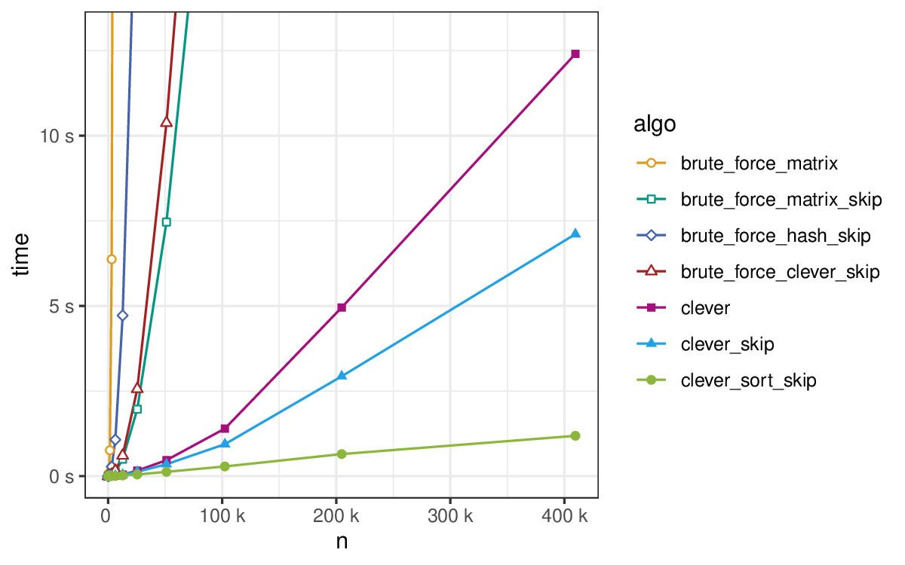

# Counting Triangles #

Comparing some algorithms for counting triangles of a graph.  The
purpose of this is mostly to illustrate for my algorithms lecture, how
some theoretical considerations concerning the asymptotic running time
impact actual performance.  All experiments are done on sparse graphs
(average degree *10*) with heterogeneous degree distribution (power
law with exponent *2.2*).

## Algorithms ##

### Brute Force ###

The brute force algorithm just iterates over all triples *(u, v, w)*
of vertices (with *u < v < w*) and checks whether they form a
triangle.  The variant `brute_force_matrix` does so by using an
adjacency matrix.  The `brute_force_*_skip` variants skip the inner
loop over (vertex *w*) if *u* and *v* are not connected.  This reduces the
running time from *Θ(n³)* to *Θ(n · m)* (assuming *n ≤ m*).

The variants `brute_force_hash_skip` and `brute_force_clever_skip`
reduce the quadratic memory consumption for the adjacency matrix.  The
former (`brute_force_hash_skip`) creates for every vertex a hash set
of all its neighbors.  The `brute_force_clever_skip` variant uses a
much more clever trick: At every point in time we only need two columns
of the adjacency matrix (the one for *u* and *v*).  Once we fixed *u*,
we can compute the column of *u* in *deg(u)* time.  The same holds for
*v*.  This overhead is asymptotically dominated by iterating over all
vertices *w* and thus basically free.

### Clever ###

The `clever*` variants check for every pairs of edges *{u, v}* and
*{v, w}* with common endpoint *v* whether *u* is adjacent to *w*.
This takes *Θ(deg(v) · deg(v))* time for the vertex *v*.  Over all
vertices this sums to *Θ(n · m)* in the worst case of a dense graph.
However it is much better for sparse graphs.  To check whether *u* and
*w* are connected, a similar trick as for `brute_force_clever_skip` is
used, i.e., once *u* is fixed, the column of the adjacency matrix of
*u* is computed in *Θ(deg(u))* time.

The `clever_*skip` variants only look for triangles with *u < v < w*
and thus skip looking at options for *w* if *u ≥ v*.  Skipping is more
useful, the higher the degree of *v* is.  Thus, it makes sense to sort
the vertex by decreasing degree, which is done in `clever_sort_skip`.
This reduces the running time to *Θ(deg(v) · deg+(v))* per vertex *v*,
where *deg+(v)* is the number of neighbors of *v* that come before *v*
in the order.  Note that if *deg(v)* is high, then *v* comes early in
the order and thus *deg+(v)* tends to be low.

## Results ##

All plots can be found in the [plots.pdf](plots.pdf) file.  Here is
one plot showing the run time of all algorithms.



## Try It Yourself ##

### Prerequisites ###

To run the experiments yourself, the following needs to be set up.

  * a Linux-like development environment (you can probably also make
    it work under Windows, but you might have to tweak some things)
  * CMake and a modern C++ compiler
  * Python 3 with pip
  * [R](https://www.r-project.org/) with packages `ggplot2`, `dplyr`,
    and `forcats` (optional, only necessary if you want to recreate
    the plots)

### Building ###

To get the code including the submodules (the [GIRG
generator](https://github.com/chistopher/girgs) for generating graphs
and [run](https://github.com/thobl/run) for running the experiments) run:

```terminal
git clone https://github.com/thobl/triangle-counting.git
git submodule init
git submodule update
```

You can build the C++ code with CMake.  It should be built in
`code/release`.

```terminal
mkdir code/release/
cd code/release/
cmake ..
make
cd ../../
```

Install the necessary dependencies for running the experiments as follows.

```terminal
cd run
pip3 install .
cd ..
```

### Running It ###

To run the experiments do the following.

```terminal
./experiments.py gen count
```

This will generate graphs and write them to `data/graphs/`.
Additionally it will run the different algorithms on the generated
graphs.  Be aware that this will use all but 2 of the cores available
on your machine.  Moreover, it will run for a few minutes and
potentially use quite some memory (up to around *1.3GB* per process).

### Plotting It ###

Run the R script provided in `eval.R`.
